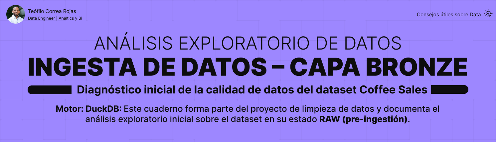

## Descripción

Esta carpeta contiene la exploración inicial del dataset fuente utilizando DuckDB.

El objetivo es comprender la estructura, tamaño y calidad básica de los datos antes de iniciar el proceso de ingestión hacia la capa Bronze.

---

## Contenido

- [📄 SQL](./sql/)
  - Queries utilizados para:
    - lectura del archivo CSV
    - conteo de registros
    - análisis de estructura (`DESCRIBE`)
    - validaciones básicas de calidad

- [📄 Documentación](./exploration/docs/)
  - `source_dataset_findings.md`: resumen de los hallazgos de la exploración

---

## Enfoque

La exploración se realizó de forma dirigida, enfocándose en columnas clave del dataset para detectar inconsistencias iniciales sin realizar un análisis completo (profiling).

---

## Resultado

Se identificaron problemas de calidad como:
- valores anómalos (`ERROR`, `UNKNOWN`)
- valores nulos o vacíos
- inconsistencias en tipos de datos

Estos hallazgos serán abordados en etapas posteriores del pipeline (Silver).